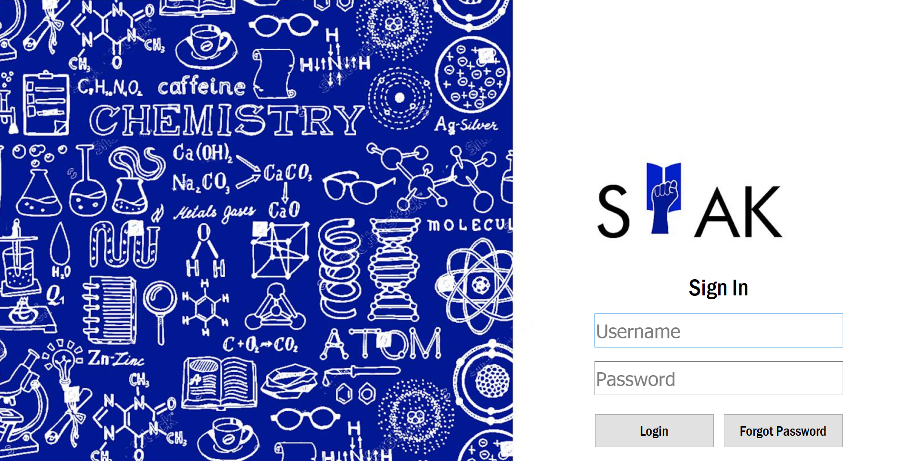
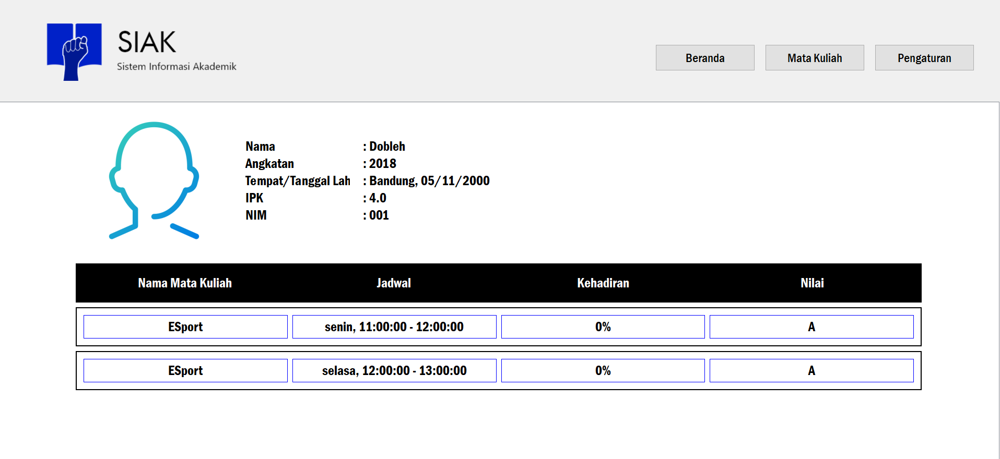
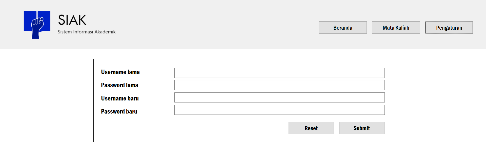

# Tugas Besar Rekayasa Perangkat Lunak (IF2250)

## Deskripsi Perangkat Lunak

 

Perangkat lunak yang kami kembangkan adalah **Aplikasi Sistem Informasi Akademik (SIAK)**.

Aplikasi Sistem Informasi Akademik (SIAK) ini dikembangkan untuk memenuhi kebutuhan dalam kegiatan
administrasi akademik di kampus STEI (Sekolah Teknik Elektro dan Informatika). Sistem
Informasi Akademik ini dikelola oleh admin dan dapat digunakan oleh mahasiswa dan dosen.

Aplikasi Sistem Informasi Akademik (SIAK) tersebut dibuat oleh **Kelompok 02 - _Skuy Living Empire_ - K03**:

| **Nama** | **NIM** |
| ------ | ------ |
| Muhammad Hasan | 13518012 |
| Muhammad Ravid Valiandi | 13518099 | 
| Mario Gunawan | 13518114 |
| Naufal Dean Anugrah | 13518123 |
| Yan Arie Motinggo | 13518129 |

## Daftar Realisasi Modul

### Modul Login

Penanggung Jawab : Naufal Dean Anugrah / 13518123

Modul Login ini berfungsi sebagai modul untuk melakukan verifikasi login user <!-- Silahkan hapus/tambah/edit deskripsi jika diperlukan -->

#### Capture Tampilan Login

#### Capture Tampilan Forgot Password

### Modul Admin

Penanggung Jawab : Muhammad Ravid Valiandi / 13518099 dan Mario Gunawan / 13518114

Modul Admin ini berfungsi sebagai modul untuk melayani permintaan Admin <!-- Silahkan hapus/tambah/edit deskripsi jika diperlukan -->

<!-- Isi Capture Tampilan Layar (jika ada) -->

### Modul Dosen

Penanggung Jawab : Yan Arie Motinggo / 13518129

Modul Desen ini berfungsi sebagai modul untuk melayani permintaan Dosen <!-- Silahkan hapus/tambah/edit deskripsi jika diperlukan -->

<!-- Isi Capture Tampilan Layar (jika ada) -->

### Modul Mahasiswa

Penanggung Jawab : Muhammad Hasan / 13518012

Modul Mahasiswa ini berfungsi sebagai modul untuk melayani permintaan Mahasiswa <!-- Silahkan hapus/tambah/edit deskripsi jika diperlukan -->

#### Capture Tampilan Beranda Mahasiswa

#### Capture Tampilan Daftar Mata Kuliah untuk Mahasiswa

#### Capture Tampilan Pengaturan User Mahasiswa

## Daftar Realisasi Tabel Basis Data

### Tabel User

Identifikasi/Nama : t_user

|  <ins>id</ins>| username | password | role | image |
| ------ | ------ | ------ | ------ | ------ |

### Tabel Waktu

Identifikasi/Nama : t_waktu

|  <ins>semester</ins>| <ins>tahun</ins> | <ins>kode_mata_kuliah</ins> | id_jadwal |
| ------ | ------ | ------ | ------ |

### Tabel Mata Kuliah

Identifikasi/Nama : t_mata_kuliah

|  <ins>kode_mata_kuliah</ins>| nama_mata_kuliah | deskripsi_mata_kuliah | kode_jurusan |
| ------ | ------ | ------ | ------ |

### Tabel Jadwal

Identifikasi/Nama : t_jadwal

|  <ins>id_jadwal</ins>|
| ------ |

### Tabel Slot Waktu

Identifikasi/Nama : t_slot_waktu

|  <ins>id_slot_waktu</ins>| hari | waktu_mulai | waktu_selesai |
| ------ | ------ | ------ | ------ |

### Tabel Slot Waktu Jadwal

Identifikasi/Nama : t_slot_waktu_jadwal

|  <ins>id_jadwal</ins> | <ins>id_slot_waktu</ins> |
| ------ | ------ |

### Tabel Jurusan

Identifikasi/Nama : t_jurusan

|  <ins>kode_jurusan</ins>|  nama_jurusan |
| ------ | ------ |

### Tabel Profil Mahasiswa

Identifikasi/Nama : t_profil_mahasiswa

|  <ins>nim</ins>| angkatan | nama_mahasiswa | tempat_lahir | tanggal_lahir | alamat_rumah | alamat_tinggal | email | user_id_mahasiswa | kode_jurusan | nip_dosen_wali |
| ------ | ------ | ------ | ------ | ------ | ------ | ------ | ------ | ------ | ------ | ------ |

### Tabel Profil Dosen

Identifikasi/Nama : t_profil_dosen

|  <ins>nip</ins>| nama_dosen | alamat_dosen | no_hp | email | user_id_dosen | kode_jurusan |
| ------ | ------ | ------ |  ------ | ------ | ------ | ------ |

### Tabel Mata Kuliah Diampu

Identifikasi/Nama : t_matkul_diampu

|  <ins>nip</ins>| total_pertemuan | <ins>kode_mata_kuliah</ins> | <ins>semester</ins> | <ins>tahun</ins> |
| ------ | ------ | ------ |  ------ | ------ |

### Tabel Mata Kuliah Diambil

Identifikasi/Nama : t_matkul_diambil

|  <ins>nim</ins>| kehadiran | indeks | <ins>kode_mata_kuliah</ins> | <ins>semester</ins> | <ins>tahun</ins> |
| ------ | ------ | ------ |  ------ | ------ | ------ |